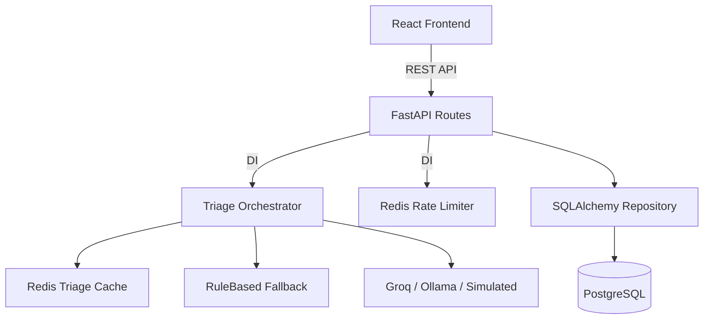

# System Architecture

## Overview
CivicPulse is designed as a modern, decoupled web application facilitating the rapid triage of municipal complaints using AI.

## Backend Architecture (4-Layer Pattern)

The FastAPI backend strictly enforces a 4-layer separation of concerns to maximize testability and maintainability:

1. **Routes (`app.routes`)**: Handles HTTP transport, request/response validation (via Pydantic), and REST semantics. Routes orchestrate cross-cutting concerns like auth or rate-limiting using FastAPI dependencies but contain **no business logic**.
2. **Services (`app.services`)**: Encapsulates core business workflows (e.g., Stats computation, Rate Limiting, Triage Caching). Services operate on domain models and coordinate between Repositories and Providers.
3. **Repositories (`app.repositories`)**: The persistence layer (`SQLAlchemyComplaintRepository`). Hides all SQL/ORM details behind a generic protocol interface, returning pure Pydantic domain models.
4. **Providers (`app.providers`)**: Adapters for external systems (e.g., Redis, LLM APIs). Specifically, the AI triage system defines a `TriageProvider` protocol, enabling seamless hot-swapping between `SimulatedTriage`, `LLMTriage` (Groq), `OllamaTriage` (Local), and `RuleBasedTriage` (Fallback).

## Cache and Rate Limiting
- **Triage Cache**: Uses a SHA-256 content hash of the complaint text and location to avoid redundant AI inference costs.
- **Stats Cache**: A read-through cache (30s TTL) for aggregate analytics, explicitly invalidated on new complaint ingestion.
- **Rate Limiting**: A Redis-backed distributed fixed-window limiter enforcing 10req/60s per client IP to prevent abuse and exhaustion of LLM API quotas.

## Diagram

